##

### About Me

I am a passionate web developer currently studying at ETIC Algarve. Committed to continuous learning and exploring new technologies to create impactful web experiences.
## Skills

- **Backend**  
    - Python with PostgreSQL and MongoDB integration

- **Frontend**  
    - JavaScript (Vanilla, React, Vue, Next.js)
    - CSS and Sass

- **Infrastructure**  
    - Git for version control
    - Docker for containerization
    - Terraform for IaC

##

### Connect with Me

