---

> ## Full-Stack Solutions Architect & Founder
>
> My guiding principle is simple: **Code is a liability. A solution is an asset.**
>
> I architect and build full-stack applications that solve core business problems, operating from the infrastructure as code (IaC) layer with Terraform and Docker, through robust backends, and up to intuitive frontend experiences. My goal is to write the least amount of code necessary to create the most value by engineering intelligent and efficient systems.
>
> Currently building my own startup and always open to connecting with fellow builders and visionaries.

---

> ## My Tech Stack
>
>| Frontend           | Backend           | Databases             | Infrastructure & DevOps      |
>|--------------------|-------------------|-----------------------|------------------------------|
>| React / Next.js    | FastAPI (Python)  | PostgreSQL            | Docker                       |
>| Vue.js             | Node.js           | MongoDB               | Terraform (IaC)              |
>| TypeScript         |                   |                       | AWS                          |
>| JavaScript (ES6+)  |                   |                       | Git                          |
>| HTML5 / CSS3 / Sass|                   |                       | Kubernetes                   |

---
>
> 
>
> ## Let's Build Together
>
> I am always open to connecting with fellow builders, visionaries, and investors who believe in leveraging technology strategically.
>
> 
---
