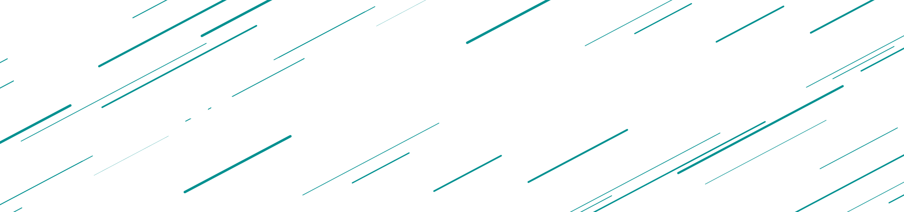

---

> ## Systems Architect: AI & Full-Stack Integration
>
>
>𝗜 𝗲𝗻𝗴𝗶𝗻𝗲𝗲𝗿 𝘀𝗰𝗮𝗹𝗮𝗯𝗹𝗲, 𝗼𝗯𝘀𝗲𝗿𝘃𝗮𝗯𝗹𝗲, 𝗮𝗻𝗱 𝗰𝗼𝘀𝘁-𝗼𝗽𝘁𝗶𝗺𝗶𝘇𝗲𝗱 𝗽𝗿𝗼𝗱𝘂𝗰𝘁𝗶𝗼𝗻 𝗲𝗻𝘃𝗶𝗿𝗼𝗻𝗺𝗲𝗻𝘁𝘀 𝗳𝗼𝗿 𝗔𝗹-𝗱𝗿𝗶𝘃𝗲𝗻 𝗮𝗽𝗽𝗹𝗶𝗰𝗮𝘁𝗶𝗼𝗻𝘀.
>
>I make sense of technical complexity through  𝗮𝘀𝘀𝗼𝗰𝗶𝗮𝘁𝗶𝘃𝗲 𝗺𝗲𝗺𝗼𝗿𝘆 𝗮𝗻𝗱 𝘃𝗶𝘀𝘂𝗮𝗹 𝘁𝗵𝗶𝗻𝗸𝗶𝗻𝗴.  I connect new problems with familiar code patterns, past debugging experience, and technical >documentation, then mentally map system components, dependencies, and data flows.
>This helps me identify  𝗽𝗼𝘁𝗲𝗻𝘁𝗶𝗮𝗹 𝗳𝗮𝗶𝗹𝘂𝗿𝗲 𝗽𝗼𝗶𝗻𝘁𝘀 𝗮𝗻𝗱 𝗰𝗼𝗺𝗽𝗮𝗿𝗲 𝗮𝗿𝗰𝗵𝗶𝘁𝗲𝗰𝘁𝘂𝗿𝗮𝗹 𝗮𝗽𝗽𝗿𝗼𝗮𝗰𝗵𝗲𝘀  before implementation, bringing clearer proposals to technical discussions and sharper >questions to validation.
>
>𝗠𝗲𝘁𝗵𝗼𝗱𝗼𝗹𝗼𝗴𝘆:  A balance between  𝗗𝗲𝗲𝗽 𝗥𝗲𝘀𝗲𝗮𝗿𝗰𝗵/𝗨𝗫 𝗠𝗮𝗽𝗽𝗶𝗻𝗴  and  𝗔𝗜-𝗔𝘂𝗴𝗺𝗲𝗻𝘁𝗲𝗱 𝗘𝘅𝗲𝗰𝘂𝘁𝗶𝗼𝗻  to guarantee architectural integrity with high-velocity deployment.
>
>𝗔𝗹-𝗗𝗿𝗶𝘃𝗲𝗻 𝗗𝗲𝘃𝗲𝗹𝗼𝗽𝗺𝗲𝗻𝘁:  I structure Al-assisted delivery through project-specific AGENTS. md instructions and Serena MCP for codebase understanding and durable documentation. I >select Codex for daily development and Claude Code for heavier requirements, then use pre-commit checks and CodeRabbit review as quality gates before changes move forward.
>
>𝗢𝗯𝗷𝗲𝗰𝘁𝗶𝘃𝗲:  Transforming complex technical requirements into resilient, client-ready architectures.
>
>𝗦𝗽𝗶𝗿𝗶𝘁𝘂𝗮𝗹 𝗴𝗿𝗼𝘄𝘁𝗵  is an important part of my personal development. I practise  𝗥𝗲𝗶𝗸𝗶  and draw on 𝗔𝘆𝘂𝗿𝘃𝗲𝗱𝗶𝗰 𝗽𝗿𝗶𝗻𝗰𝗶𝗽𝗹𝗲𝘀  toguide my dietary choices.
>
>𝗧𝗶𝗺𝗲 𝗶𝗻 𝗻𝗮𝘁𝘂𝗿𝗲  brings balance to everyday city life, with  𝘀𝗲𝗮 𝘀𝘄𝗶𝗺𝗺𝗶𝗻𝗴  as my preferred form of exercise. I also practise 𝗺𝗮𝗿𝘁𝗶𝗮𝗹 𝗮𝗿𝘁𝘀 , making space for both physical discipline >and reflection.
---

> ## My Tech Stack
>
>| Frontend           | Backend & Systems | Databases             | Infrastructure & DevOps      | AI/LLM                         |
>|--------------------|-------------------|-----------------------|------------------------------|--------------------------------|
>| Vite / Next.js     | FastAPI (Python)  | PostgreSQL            | Docker                       | RAG Pipelines                  |
>|                    | Django            | MongoDB               | Terraform (IaC)              | Agentic Orchestration (CrewAI) |
>| TypeScript         | Node.js           | Supabase              | Azure/GCP                    | LLMOps (Langfuse, LiteLLM)     |
>|                    | Rust (Axium)      | ChromaDB              | Git                          | Observability/Traceability     |
>| Tailwind CSS       |                   |                       | CI/CD                        | AI Cumpliance                  |

---
>
> 
>
> ## Let's Build Together
>
> I am always open to connecting with fellow builders, visionaries, and investors who believe in leveraging technology strategically.
>
> 
---
